# CNC

We're using this to keep track of using our CNC projects and protocols. I'm an amateur figuring out this by looking at resources online, so these are mostly just notes so I don't forget, but maybe others will find them useful, too.

## Machine itself

CNC: Purchased a [MySweety 3018](https://www.amazon.com/gp/product/B07DXMFY38/ref=ppx_yo_dt_b_asin_title_o04_s00?ie=UTF8&psc=1) ("Upgrade Version CNC 3018 Pro GRBL Control DIY Mini CNC Machine, 3 Axis Pcb Milling Machine, Wood Router Engraver with Offline Controller, with ER11 and 5mm Extension Rod"). $269

**Pros:**

* Not too expensive
* Fairly large bed (3018 = 30 cm x 18 cm (11.8 x 7 inches), not a model number)
* The offline controller doesn't require you to have a computer hooked up, can just use an SD card

**Cons:**

* Came with metal shavings and oil on all the aluminum beams, requiring a fair bit of cleaning
* The bolts connecting the bed to the sliding plastic were too short. Got some longer ones at Lowes; would have been better to order exactly the ones I wanted online, as these were a bit too long (used washers to fix this).
* The machine came with a link to a file sharing site with info that looked a bit skeevy (lots of files, not clear names, etc.). It's not needed for software or anything, just instructions, but it's not great.
* Connection between the motors and threaded rods uses adaptors with set screws; so far, those have come loose about 2/3 of the first prints, making the print fail (b/c an axis of movement stops). I've now put the set screws in both sides of the rod (i.e., where the adaptor connects to the motor, there's two holes for set screws, but the instructions indicated use just one side -- using two has been better).

Overall, I think this was ok value for the price; had I more money available for this, I'd probably look into other options, though.

## Controller

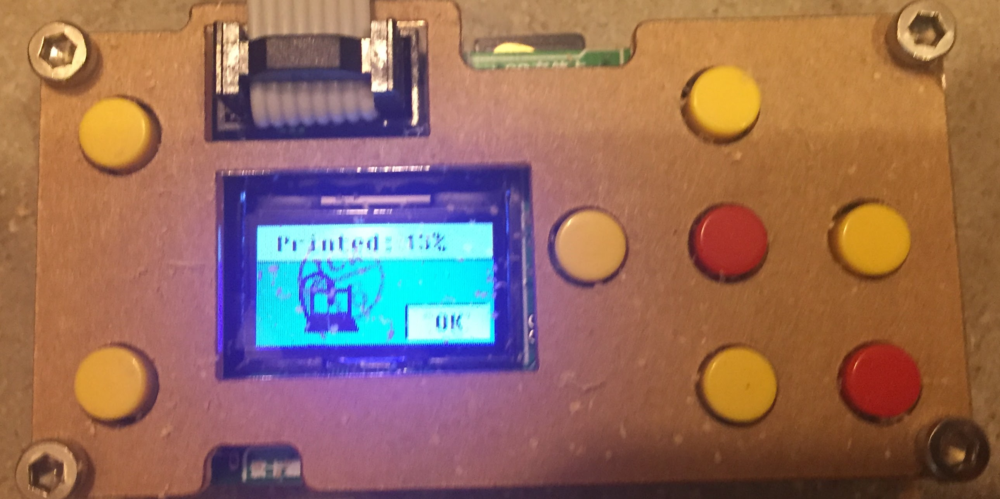

The controller is pretty simple: put a card in the back, then use the buttons to choose what to do. Center red button is select, the yellow buttons in the control menu can be used to move the spindle up/down (left buttons), forward/back (top/bottom), left/right (left/right). The one thing that was confusing was how to go back up a level in the menus: do to, hold the bottom right button for a few seconds.

To print, file -> file.name, then ok. It may take several seconds to a minute or so (I presume while it loads the g-code into its memory), then start printing.

## Materials

So far, we've tried baltic birch plywood and basswood boards. We recently ordered [baltic birch plywood](https://www.woodcraft.com/products/baltic-birch-plywood-9mm-3-8-x-12-x-12) from Woodcraft: 12 inches x 12 inches by 3/8 inch thick (about 9.5 mm thick) to batch out some presents: it just barely fits on our machine.

## Generating files

Like most CNC, uses g-code files (which have file extension .nc). Using http://easel.inventables.com has been good for generating these files. Exporting g-code requires a pro version, which is free four days a month (yay) but $20/month after that (we've gotten by with the free trials so far).

Some settings required to make it work for our machine:

* Machine -> Spindle control -> **Automatic**
* Machine -> RPM -> **12000**

Setting both of these are required for the spindle (the motor that turns the bit) to actually spin on our machine.

Bit: the bit that came with our machine was a 20 degree bit, 0.125 inches diameter. So need to set this as a custom V Bits in the bits menu.

To generate the gcode, Machine -> Advanced -> Generate g-code. Then a green Export g-code button will appear.

Sample start of g-code file:

```
G20
M3 S12000
G90
G1 Z0.15000 F9.0
G0 X0.33728 Y1.00067
G1 Z-0.02800 F9.0
G1 X0.36514 Y1.01254 F28.0
G1 X0.38391 Y1.03589 F28.0
G1 X0.39362 Y1.07108 F28.0
G1 X0.39658 Y1.35318 F28.0
G1 X0.40280 Y1.36838 F28.0
G1 X0.40909 Y1.37378 F28.0
G1 X0.43283 Y1.37848 F28.0
G1 X0.43283 Y1.38400 F28.0
```

## Files

Files we've run (and are in the data dir)

**Burgoyne.nc** First output. My son wanted to do carving of John Burgoyne for a school project; the symbol on the right was for a birthday present. The head carving came out ok, the x axis failed on the design (collar between a motor and threaded rod came undone), and, oddly, the "e" was dropped off his last name in the final carving (I think as a result of the x axis failure).

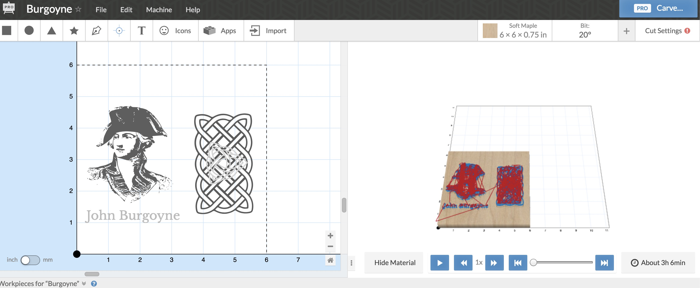

Final output

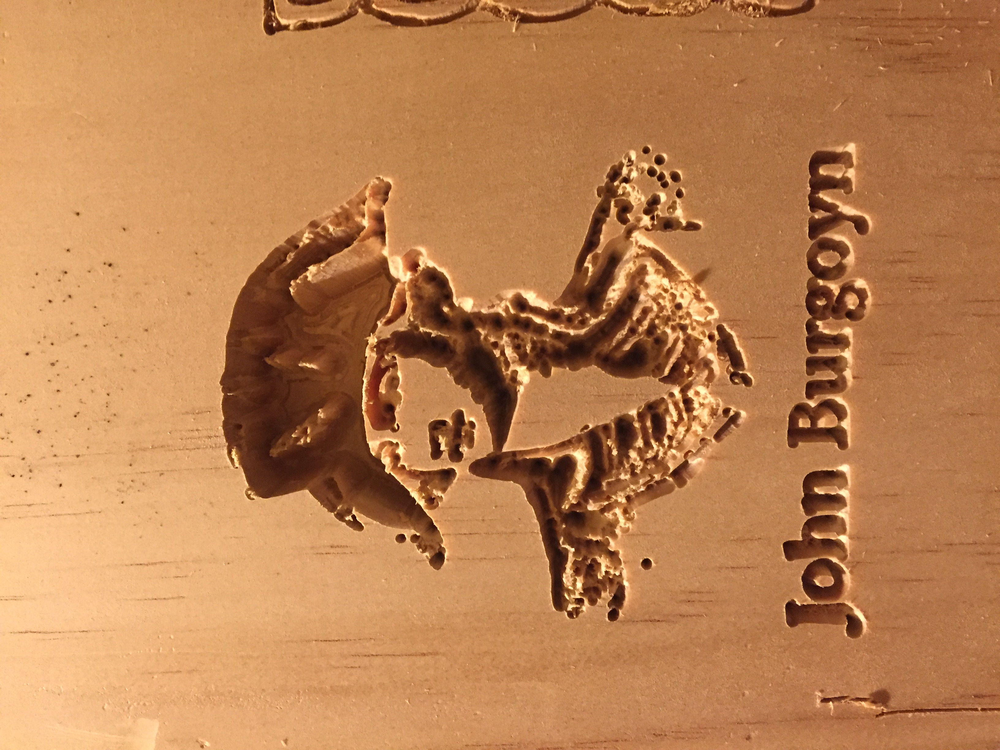


**Birthday.nc** Another try of the birthday design.

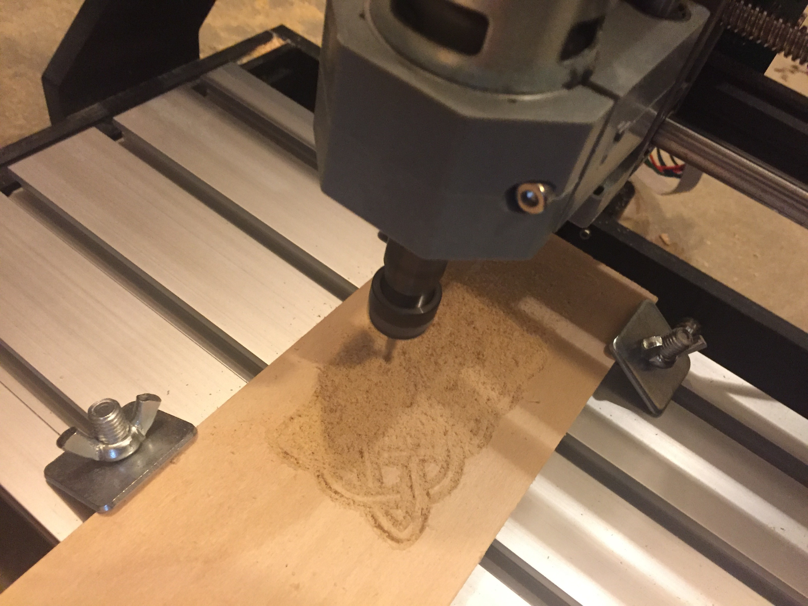

**EinsteinQuote.nc** A quote supposedly (but not really) by Einstein my daughter liked. Modification here: adding M5 to the code before the end to make the spindle stop spinning (with past designs, the machine would keep spinning even after the design was done). It's the first `M5` call below (but may actually be a few lines too high)

```
G1 Z-0.10000 F9.0
G1 X8.92793 Y4.80617 Z-0.05995 F9.2
G1 X8.93582 Y4.79779 Z0.00000 F9.2
G1 X8.92793 Y4.80617 Z-0.05995 F9.2
G1 X8.92364 Y4.81402 Z-0.10000 F9.2
G1 X8.92365 Y4.81403 F30.0
M5
G20
G90
G1 Z0.15000 F9.0
G0 X0.00000 Y0.00000
G4 P0.1
M5
```

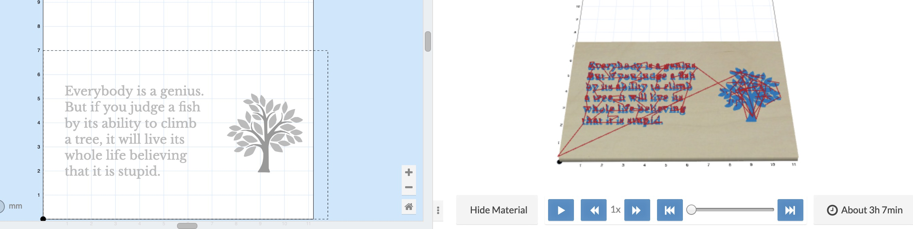

Here's the version after it came off the CNC

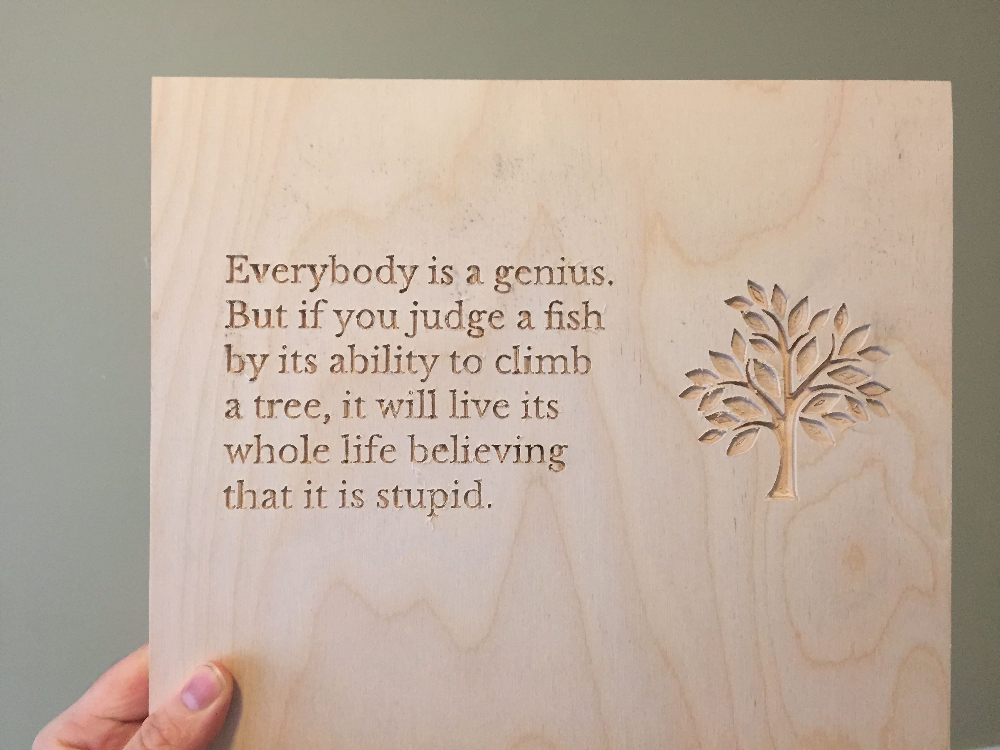

And a closeup of the tree, so you can see how the v-bit results in a not smooth bottom.

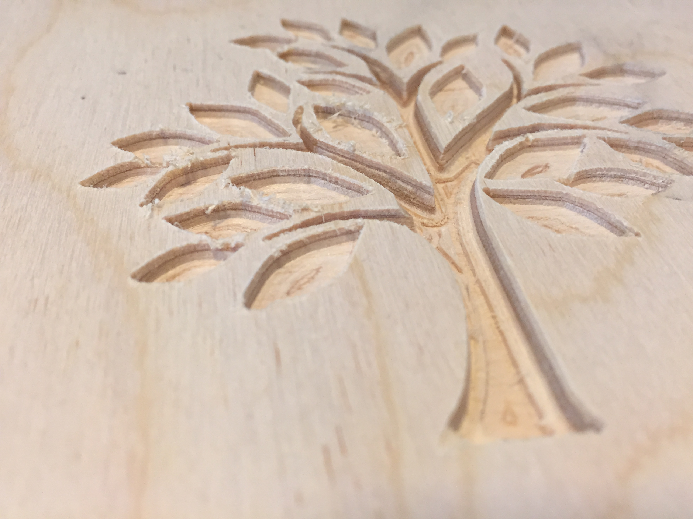

**IfYouDontLikeToRead.nc** Quote from JK Rowling

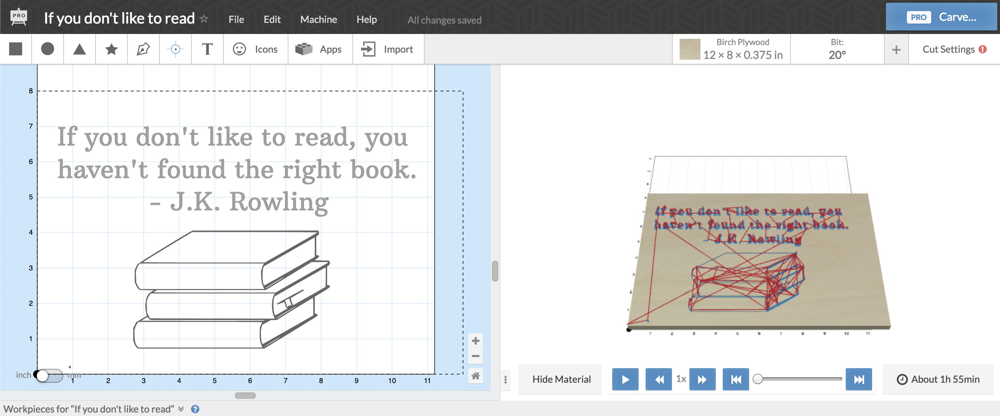

**FishBottom.nc** and **FishTop.nc** Fish, trying inverted to have the image pop. Since the full image won't print in one go, trying it in two passes.


**YouOnlyFailWhenYouStopTrying.nc** More quotes for teacher present

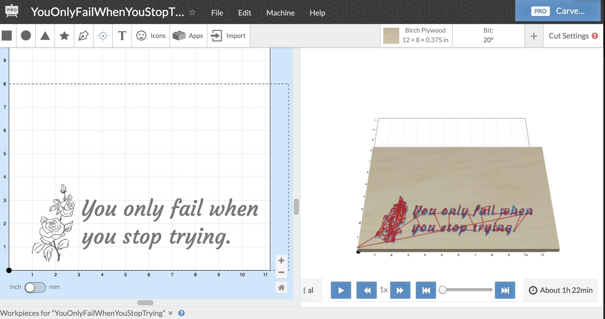

And the version after the CNC

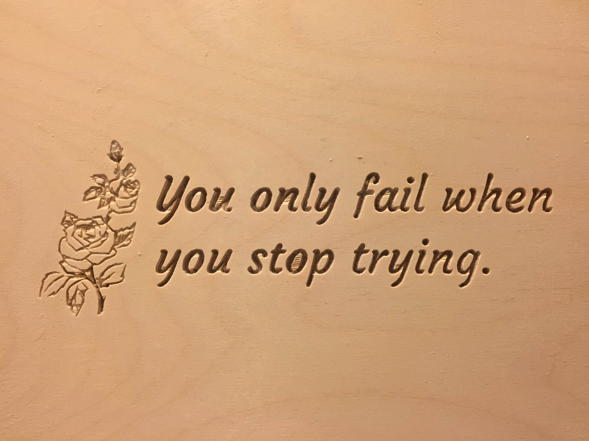

**BertolliniBennett.nc** Two teacher presents on one board

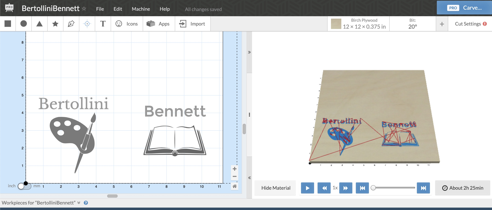

**ChapmanEmmons.nc** Two more teacher presents on one board

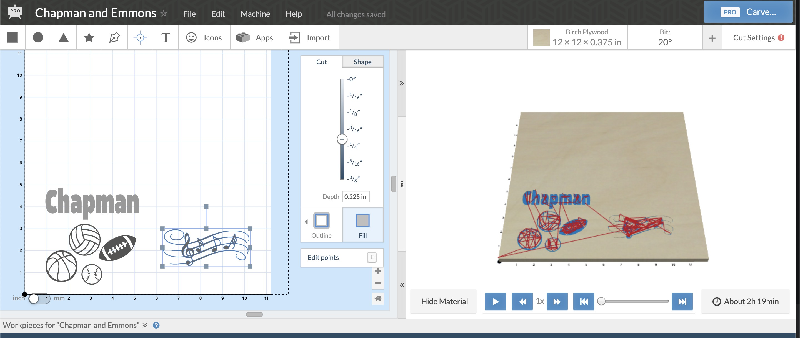

**RamsLogo.nc** Rocky Hill Rams logo

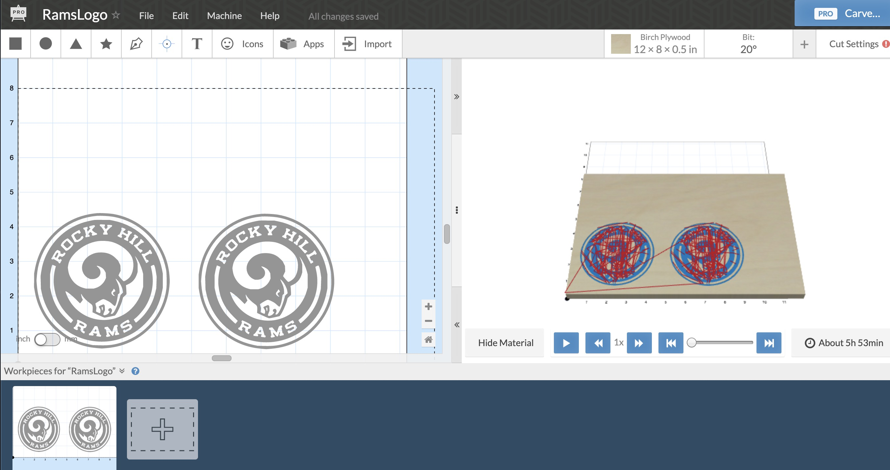

**Tates.nc** Tate's school logo

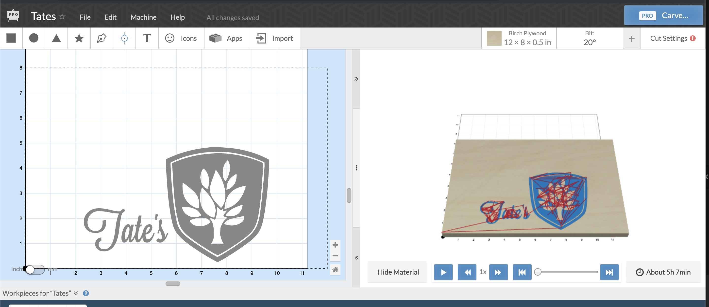 
