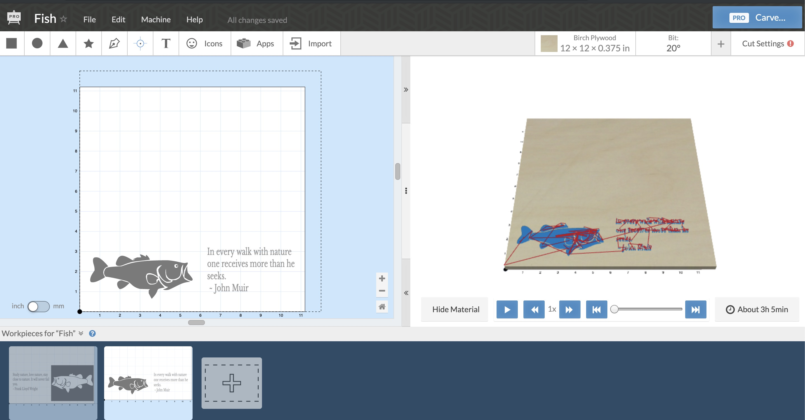

# CNC

We're using this to keep track of using our CNC projects and protocols. I'm an amateur figuring out this by looking at resources online, so these are mostly just notes so I don't forget, but maybe others will find them useful, too.

## Machine itself

CNC: Purchased a [MySweety 3018](https://www.amazon.com/gp/product/B07DXMFY38/ref=ppx_yo_dt_b_asin_title_o04_s00?ie=UTF8&psc=1) ("Upgrade Version CNC 3018 Pro GRBL Control DIY Mini CNC Machine, 3 Axis Pcb Milling Machine, Wood Router Engraver with Offline Controller, with ER11 and 5mm Extension Rod"). $269

**Pros:**

* Not too expensive
* Fairly large bed (3018 = 30 cm x 18 cm (11.8 x 7 inches), not a model number)
* The offline controller doesn't require you to have a computer hooked up, can just use an SD card

**Cons:**

* Came with metal shavings and oil on all the aluminum beams, requiring a fair bit of cleaning
* The bolts connecting the bed to the sliding plastic were too short. Got some longer ones at Lowes; would have been better to order exactly the ones I wanted online, as these were a bit too long (used washers to fix this).
* The machine came with a link to a file sharing site with info that looked a bit skeevy (lots of files, not clear names, etc.). It's not needed for software or anything, just instructions, but it's not great.
* Connection between the motors and threaded rods uses adaptors with set screws; so far, those have come loose about 2/3 of the first prints, making the print fail (b/c an axis of movement stops). I've now put the set screws in both sides of the rod (i.e., where the adaptor connects to the motor, there's two holes for set screws, but the instructions indicated use just one side -- using two has been better).

Overall, I think this was ok value for the price.

**Update:**

A screw became stripped on the head with the spindle. I reached out to the company: they asked for more detail, then sent a replacement for this quickly. I've been impressed by their level of service -- far beyond what I expected from a fairly inexpensive, entry level CNC.

## Controller


The controller is pretty simple: put a card in the back, then use the buttons to choose what to do. Center red button is select, the yellow buttons in the control menu can be used to move the spindle up/down (left buttons), forward/back (top/bottom), left/right (left/right). The center right button changes the multiplier for the movement: if set to 10X, a single button press moves the spindle a lot, if set to 0.1, the press moves it a tiny bit. Good for aligning the spindle with the desired origin.

The one thing that was confusing was how to go back up a level in the menus: do to, hold the bottom right button for a few seconds.

To print, file -> file.name, then ok. It may take several seconds to a minute or so (I presume while it loads the g-code into its memory), then start printing.

## Materials

So far, we've tried baltic birch plywood and basswood boards. We recently ordered [baltic birch plywood](https://www.woodcraft.com/products/baltic-birch-plywood-9mm-3-8-x-12-x-12) from Woodcraft: 12 inches x 12 inches by 3/8 inch thick (about 9.5 mm thick) to batch out some presents: it just barely fits on our machine.

## Generating files

Like most CNC, uses g-code files (which have file extension .nc). Using http://easel.inventables.com has been good for generating these files. Exporting g-code requires a pro version, which is free four days a month (yay) but $20/month after that (we've gotten by with the free trials so far).

Some settings required to make it work for our machine:

* Machine -> Spindle control -> **Automatic**
* Machine -> RPM -> **12000**

Setting both of these are required for the spindle (the motor that turns the bit) to actually spin on our machine.

Bit: the bit that came with our machine was a 20 degree bit, 0.125 inches diameter. So need to set this as a custom V Bits in the bits menu.

To generate the gcode, Machine -> Advanced -> Generate g-code. Then a green Export g-code button will appear.

Sample start of g-code file:

```
G20
M3 S12000
G90
G1 Z0.15000 F9.0
G0 X0.33728 Y1.00067
G1 Z-0.02800 F9.0
G1 X0.36514 Y1.01254 F28.0
G1 X0.38391 Y1.03589 F28.0
G1 X0.39362 Y1.07108 F28.0
G1 X0.39658 Y1.35318 F28.0
G1 X0.40280 Y1.36838 F28.0
G1 X0.40909 Y1.37378 F28.0
G1 X0.43283 Y1.37848 F28.0
G1 X0.43283 Y1.38400 F28.0
```

## Files

Files we've run (and are in the data dir)

**Burgoyne.nc** First output. My son wanted to do carving of John Burgoyne for a school project; the symbol on the right was for a birthday present. The head carving came out ok, the x axis failed on the design (collar between a motor and threaded rod came undone), and, oddly, the "e" was dropped off his last name in the final carving (I think as a result of the x axis failure).


Final output


**Birthday.nc** Another try of the birthday design.


**EinsteinQuote.nc** A quote supposedly (but not really) by Einstein my daughter liked. Modification here: adding M5 to the code before the end to make the spindle stop spinning (with past designs, the machine would keep spinning even after the design was done). It's the first `M5` call below (but may actually be a few lines too high)

```
G1 Z-0.10000 F9.0
G1 X8.92793 Y4.80617 Z-0.05995 F9.2
G1 X8.93582 Y4.79779 Z0.00000 F9.2
G1 X8.92793 Y4.80617 Z-0.05995 F9.2
G1 X8.92364 Y4.81402 Z-0.10000 F9.2
G1 X8.92365 Y4.81403 F30.0
M5
G20
G90
G1 Z0.15000 F9.0
G0 X0.00000 Y0.00000
G4 P0.1
M5
```


Here's the version after it came off the CNC


And a closeup of the tree, so you can see how the v-bit results in a not smooth bottom.


**IfYouDontLikeToRead.nc** Quote from JK Rowling


**FishBottom.nc** and **FishTop.nc** Fish, trying inverted to have the image pop. Since the full image won't print in one go, trying it in two passes.



**YouOnlyFailWhenYouStopTrying.nc** More quotes for teacher present


And the version after the CNC


**RamsLogo.nc** Rocky Hill Rams logo


**Tates.nc** Tate's school logo


The screw inside the housing for the spindle, which moved it along the x axis, stopped engaging the threaded rod (perhaps the threads got stripped). I've emailed the company for help, but in the meantime, used shapelock (see [article](https://makezine.com/2011/09/28/the-many-uses-of-shapelock/)) to make a nut to use. The downside is that it sticks out of the right side of the housing, limiting the x axis travel (which I only discovered when the right side of the below print failed).

**BertolliniBennett.nc** Two teacher presents on one board


I've thus created a new print with this and other teacher gifts to put them all on one board, and leaving the part on the right open.

**BennettAndOthers.nc**

s

## True 3D

The above files are made with Easel and work well for essentially 2D: taking letters or a flat image and extruding them into wood. But what about topography or things like that, where there are multiple heights? For that, use Fusion 360 and the tools there.

Get a 3D shape file. [Thingiverse](https://www.thingiverse.com/) is good in general; Thatcher Chamberlin's [http://jthatch.com/Terrain2STL/](Terrain2STL) is good for topography.

Bring it into Fusion 360.

Scale it so it's the right size (the Inspect tool tab has a ruler).

Go to Manufacture area.

Select Setup -> New Setup


Select a corner for the origin


Check dimensions, then click ok


Select the Morphed Spiral approach


Select the appropriate tool. For mine, I have a 20 degree V bit, so I got an example tool definition from a forum for the X-carve and used that.


I don't have a coolant for my CNC, so I change the coolant setting


In the next tab within the morphed spiral window, click on tool orientation, choose stock box point (the dimensions of the wood you're cutting), and pick where you want the origin to be (where the zero is for your tool). I typically choose the front left corner.


Stepover is how far between parallel passes. I've found that with a V bit the spacing is too large, so it makes visible lines. A smaller stepover will make a finer cut, but at the cost of more time to run.


I want to do multiple passes in the z (vertical) direction so the bit doesn't have to remove the entire depth at once. This is done by selecting the Axial offset passes button and then increasing the number of stepdowns. The greater the number, the more passes but the less removed each pass.


After all that, click ok. It will then take some time (minutes, maybe even longer) to plan the passes.

You can then see the paths the spindle will take


And you can use the Actions -> simulate option to see how the spindle will move (and how long the whole run will take).


You will then need to export this in a form your CNC can use. This is done with the Actions -> Post Process


For my CNC, I choose the Grbl option. A different machine may require a different option.


This will create a file you can then copy onto the micro SD card for the CNC.

```
(1001)
G90 G94
G17
G20
G28 G91 Z0
G90

(Morphed Spiral5)
T1 M6
S12000 M3
G54
G0 X-3.4447 Y2.3845
Z0.6
Z-0.0357
G1 X-3.4444 Z-0.0383 F1.97
X-3.4436 Z-0.0407
X-3.4422 Z-0.0429
X-3.4404 Z-0.0448
X-3.4382 Z-0.0462
X-3.4358 Z-0.0471
X-3.4332 Z-0.0475
X-3.4306 Z-0.0472
X-3.4281 Z-0.0465
X-3.4258 Z-0.0451
X-3.4121 Z-0.0349
X-3.4082 Z-0.0319
X-3.3993 Y2.3844 Z-0.0229
X-3.3894 Z-0.0151
X-3.3801 Z-0.0091
X-3.3674 Z0.0046
X-3.3614 Z0.0115

(many, many more lines)

X-3.5384 Z-0.1986
X-3.5072 Z-0.1985
X-3.4788 Z-0.1982
X-3.4612 Z-0.198
X-3.4504 Z-0.1978
X-3.4259 Z-0.197
G18 G2 X-3.4145 Z-0.1852 I-0.0004 K0.0118
G0 Z0.6
G17
G28 G91 Z0
G90
G28 G91 X0 Y0
G90
M5
M30
```
